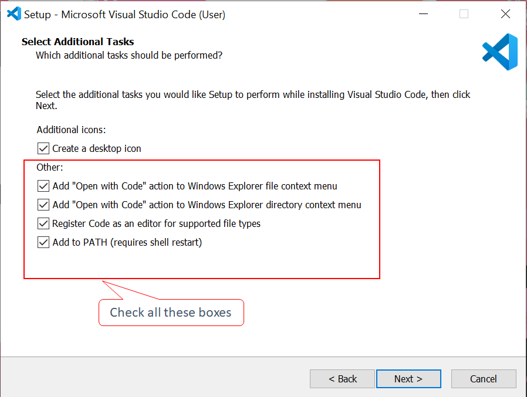

# TABLE OF CONTENTS

1. Introduction
    - [C++ Overview](#11-c-overview)
    - [Getting Started with C++](#12-getting-started-with-c)
    - [Basic Structure & Syntax](#13-basic-structure--syntax)
    - [C++ Comments](#14-c-comments)
    - [C++ Variables](#15-c-variables)
2. C++ Data Types, Operators & User I/O
    - [C++ Data Types & Constants](#21-c-data-types--constants)
    - [C++ Operators](#22-c-operators)
    - [C++ Manipulators](#23-c-manipulators)
    - [C++ Basic Input/Output](#24-c-basic-inputoutput)
3. C++ Conditional Statements
    - [Control Structure](#31-control-structure)
    - [C++ If Else](#32-c-if-else)
    - [C++ Switch Case](#33-c-switch-case)
4. C++ Iteration Statements
    - [C++ Loops](#41-c-loops)
    - [For Loop](#42-for-loop)
    - [While Loop](#43-while-loop)
    - [Do While Loop](#44-do-while-loop)
5. C++ Break/Continue
    - [Break Statment](#51-break-statment)
    - [Continue Statement](#52-continue-statement)
6. C++ Arrays
    - [Array Basics](#61-array-basics)
    - [Array Operations](#62-array-operations)
7. C++ Pointers
    - [Operation on Pointers](#71-operation-on-pointers)
8. C++ Strings
    - [Strings](#81-strings)
9. C++ Structures, Unions & Enums
    - [Structures](#91-structures)
    - [Unions](#92-unions)
    - [Enums](#93-enums)

# 1. Introduction

## 1.1. C++ Overview

### **What is C++ ?**

- C++ -> 1979 -> Bjarne Stroustrup -> Extension of C
- C++ : fast programs, cross-platform, more control over system resources + memory management
- Used to create high performance applications and software systems.
- Major updates
    - 2011 -> C++11
    - 2014 -> C++14
    - 2017 -> C++17

### **Why should we learn C++/ Features of C++?**

- C++ is one of the world's most popular programming languages.
- Widely used in - operating systems, GUIs, and embedded systems etc.
- C++ is an object-oriented programming language that gives a clear structure to programs and allows code to be reused, lowering development costs.
- With C++, you can develop applications or heavy games that can run on different platforms.
- It is close to other programming languages - C# , Java , which makes it easy for programmers to switch to C++ or vice versa while it is actually very easy to learn.

### **How is it different from C?**

- The syntax of C++ is almost identical to that of C, as C++ was developed as an extension of C.
- In contrast to C, C++ supports classes and objects, while C does not.

<br>

## 1.2. Getting Started with C++

### **Requirements before you start**

- To start using C++, you need two things:
- A text editor, like Notepad, or an IDE, like VSCode to act as a platform for you to write C++ code.
- A compiler, like GCC->translate C++-code (high-level-language)->low-level language (machine-language) that the computer will understand.

### **What is an IDE?**
- IDE stands for Integrated Development Environment. 
- It is nothing more than an enhanced version of a text editor that helps you write more efficient and nicer code. 
- It helps to differentiate different parts of your codes with different colors and notifies you if you are missing some semicolon or bracket at some place by highlighting that area.
- A lot of IDEs are available, such as DEVC++ or Code Blocks, but I will prefer using VS Code.

### **Installing VSCode**

- Visit https://code.visualstudio.com/download
- Click on the download option as per your operating system.
- After the download is completed, open the setup and run it by saving VS Code in the default location. 
- You will need to click the next button again and again until the installation process begins.
- Check all the boxes to open VS code in any directory.



### **What is a Compiler?**

- Used to run the program of a certain language which is generally high-level by converting the code into a language that is low-level that our computer could understand.
- There are a lot of compilers available, but we will proceed with MinGW because it will fulfill all of our requirements, and also it is recommended by Microsoft itself.

### **Setting up the compiler**
- Visit https://code.visualstudio.com/docs/languages/cpp
- Select C++ from the sidebar.
- Choose “GCC via Mingw-w64 on Windows” from the options shown there.
- Select the install sourceforge option.
- After the downloading gets completed, run the setup and choose all the default options.

### **Setting Path for Compiler**

- Go to the C directory. Navigate into the Program Files. Then, open MinGW-64. Open MinGW-32. And then the bin folder. After reaching the bin, save the path or URL to the bin.
- Then go to the properties of ‘This PC’.
- Select ‘Advanced System Settings’.
- Select the ‘Environment Variable’ option.
- Then select System-variables->Path->Edit->New-> then paste the copied path.
- And now,  you can visit your IDE and run your C++ programs on it. The configuration part is done.

### **Writing your first code in C++**

- Open VSCode. Here’s the simplest print statement we can start with.
```cpp
#include <iostream>
 
int main()
{
    std::cout << "Hello World";
    return 0;
}
```

Output:
```
Hello World
```

<br>

## 1.3. Basic Structure & Syntax

Programming in C++ involves following a basic structure throughout. To understand that basic structure, the first program we learned writing in C++ will be referred to. 
```cpp
#include <iostream>
 
int main()
{
    std::cout << "Hello World";
    return 0;
}
```
Here’s what it can be broken down to.

### **Pre-processor commands/ Header files**

It is common for C++ programs to include many built-in elements from the standard C++ library, including classes, keywords, constants, operators, etc. It is necessary to include an appropriate header file in a program in order to use such pre-defined elements.

In the above program, ```#include <iostream>``` was the line put to include the **header file iostream**.  The iostream library helps us to get input data and show output data. The iostream library also has many more uses and error facilities; it is not only limited to input and output.

Header file are both system defined and user defined. To know more about header files, go to the documentary here, https://en.cppreference.com/w/cpp/header.

### **Definition Section**

Here, all the variables, or other user-defined data types are declared. These variables are used throughout the program and all the functions.

### **Function Declaration**

- After the definition of all the other entities, here we declare all the functions a program needs. These are generally user-defined.
- Every program contains one **main** parent function which tells the compiler where to start the execution of the program. 
- All the statements that are to be executed are written in the **main** function.
- Only the instructions enclosed in **curly braces {}** are considered for execution by the compiler.
- After all instructions in the main function have been executed, control leaves the main function and the program ends.
- A C++ program is made up of different tokens combined. These tokens include:
    - Keywords
    - Identifiers
    - Constants
    - String Literal
    - Symbols & Operators

### **Keywords**

-> reserved words -> can not be used elsewhere in the program for naming a variable or a function.<br> 
-> Have a specific function or task -> Their functionalities are pre-defined. 

One such example of a keyword could be ```return``` which is used to build return statements for functions. Other examples are **auto, if, default**, etc.

There is a list of reserved keywords which cannot be reused by the programmer or overloaded. One can find the list here, https://en.cppreference.com/w/cpp/keyword. 

### **Identifiers**

- Identifiers are names given to variables or functions to differentiate them from one another. Their definitions are solely based on our choice but there are a few rules that we have to follow while naming identifiers. One such rule says that the name can not contain special symbols such as **@, -, *, <**, etc.

- C++ is a **case-sensitive language** so an identifier containing a capital letter and another one containing a small letter in the same place will be different. For example, the three words: **Code**, **code**, and **cOde** can be used as three different identifiers.

### **Constants**

Constants are very similar to a variable and they can also be of any data type. The only difference between a constant and a variable is that a constant’s value never changes.

### **String Literal**

String literals or string constants are a sequence of characters enclosed in double quotation(**""**) marks. Escape sequences are also string literals.

### **Symbols and Operators**

Symbols are special characters reserved to perform certain actions. Using them lets the compiler know what specific tasks should be performed on the given data. Several examples of symbols are arithmetical operators such as +, *, or bitwise operators such as ^, &.

<br>

## 1.4. C++ Comments

A comment is a human-readable text in the source code, which is ignored by the compiler. Comments can be used to insert any informative piece which a programmer does not wish to be executed. It could be either to explain a piece of code or to make it more readable. In addition, it can be used to prevent the execution of alternative code when the process of debugging is done.<br>
Comments can be singled-lined or multi-lined.

### Single Line Comments

- Single-line comments start with two forward slashes (//).
- Any information after the slashes // lying on the same line would be ignored (will not be executed) since they become unparsable. 

An example of how we use a single-line comment
```cpp
#include <iostream>
 
int main()
{
    // This is a single line comment
    std::cout << "Hello World";
    return 0;
}
```

### Multi-line comments

- A multi-line comment starts with /* and ends with */.
- Any information between /* and */ will be ignored by the compiler.

An example of how we use a multi-line comment
```cpp
#include <iostream>
 
int main()
{
    /* This is a
    multi-line
    comment */
 
    std::cout << "Hello World";
    return 0;
}
```

<br>

## 1.5. C++ Variables

- A variable is a container to hold data.<br> 
Like for storing something we need containers . Now for different types of things we need different container likewise in C++ to store different types of data we have different datatypes in C++. 
> C++ provides a layer of abstraction (from low level to high level) where you can represent your data as int, float, double etc.

- Variable can be of various types. Primarily we have these variable types in C++ :
1. int - eg. 1,3,2,56,0,...etc.
2. float - eg. 1.34, 3.54,...etc.
3. char - eg. 'c', 'd', 'a', 'B' ... etc.
4. double - it is same as float with more precision. eg. 1.2435 , ... etc.
5. boolean - True or False.
- int sum = 36; means sum is an integer variable which holds value 36 in memory.

### **Declaration**

We cannot declare a variable without specifying its data type. The data type of a variable depends on what we want to store in the variable and how much space we want it to hold. The syntax for declaring a variable is simple:

```cpp 
data_type  variable_name;
```
OR
```cpp
data_type  variable_name = value;
```

### **Naming a Variable**

There is no limit to what we can call a variable. Yet there are specific rules we must follow while naming a variable:
- A variable name in C++ can have a length of range 1 to 255 characters
- A variable name can only contain alphabets, digits, and underscores(_).
- A variable cannot start with a digit.
- A variable cannot include any white space in its name.
- Variable names are case sensitive
- The name should not be a reserved keyword or any special character. 

### **Variable Scope**

The scope of a variable is the region in a program where the existence of that variable is valid. Based on its scope, variables can be classified into two types:

**Local variables:**

Local variables are declared inside the braces of any function and can be assessed only from that particular function. 

**Global variables:**

Global variables are declared outside of any function and can be accessed from anywhere.

An example that demonstrates the difference in applications of a local and a global variable is given below.
```cpp
#include <iostream>
using namespace std;
 
int a = 5; //global variable
 
void func()
{
    cout << a << endl;
}
 
int main()
{
    int a = 10; //local variable
    cout << a << endl;
    func();
    return 0;
}
```
```
Output:

10
5
```
*Explanation: A local variable a was declared in the main function, and when printed, gave 10. This is because, within the body of a function, a local variable takes precedence over a global variable with the same name. But since there was no variable declared in the func function, it considered the global variable a for printing, and hence the value 5.*

A variable, as its name is defined, can be altered, or its value can be changed, but the same is not true for its type. If a variable is of integer type, it will only store an integer value through a program. We cannot assign a character type value to an integer variable. We can not even store a decimal value into an integer variable.

[**Jump to Index**](#table-of-contents)

<br>

## 2.1. C++ Data Types & Constants

### C++ Data Types

Data types define the type of data a variable can hold; for example, an integer variable can hold integer data, a character can hold character data, etc.<br>
Data types in C++ are categorized into three groups:

**Built-in data types** 

These data types are pre-defined for a language and could be used directly by the programmer.<br>
Examples are: Int, Float, Char, Double, Boolean

**User-defined data types**

These data types are defined by the user itself.<br>
Examples are: Class, Struct, Union, Enum

**Derived data types**

These data types are derived from the primitive built-in data types.<br>
Examples are: Array, Pointer, Function

Some of the popular built-in data types and their applications are:

|Data Type|Size|Description|
|---|---|---|
|int|2 or 4 bytes|Stores whole numbers, without decimals
|float|4 bytes|Stores fractional numbers, containing one or more decimals. They require 4 bytes of memory space.
|double|8 bytes|Stores fractional numbers, with more precision. They require 8 bytes of memory space.
|char|1 byte|Stores a single character/letter/number, or ASCII values
|boolean|1 byte|Stores true or false values

<br>

### Data Type size and range in C++ (For G++ 64 BIT)

- For n = size in bits (1 byte = 8 bits)
- Range = -2^(n-1) to 2^(n-1)-1 (**for signed**) <br>      
- Range = 0 to 2*(2^(n-1)-1) (**for unsigned**)

| Data Type | Size (in Bytes) | Range 
|---|---|---|
| short int | 2 | -32,768 to 32,767
| unsigned short int | 2 | 0 to 65,535
| unsigned int | 2 | 0 to 4,294,967,295
| int | 4 | -2,147,483,648 to 2,147,483,647
| long int | 4 | -2,147,483,648 to 2,147,483,647
| unsigned long int | 4 | 0 to 4,294,967,295
| long long int | 8 | -2^(63) to 2^(63)-1
| unsigned long long int | 8 | 0 to 2*(2^(63)-1)
| signed char | 1 | -128 to 127
| unsigned char | 1 | 0 to 255
| unsigned char | 1 | 0 to 255
| float | 4 | -2^31 to (2^31)-1 
| double | 8 | -2^63 to (2^63)-1
| long double | 12 | -2^95 to (2^95)-1
| wchar_t | 2 or 4 | 1 wide character

### C++ Constants

Constants are unchangeable; when a constant variable is initialized in a program, its value cannot be changed afterwards.
```cpp
#include <iostream>
using namespace std;
 
int main()
{
    const float PI = 3.14;
    cout << "The value of PI is " << PI << endl;
    PI = 3.00; //error, since changing a const variable is not allowed.
}
```
```
Output:

error: assignment of read-only variable 'PI'
```

<br>

## 2.2. C++ Operators

1. Arithmetic operators ( +, -, *, /, % )
2. Assignment operator (=)
3. Compound assignment (+=, -=, *=, /=, %=, >>=, <<=, &=, ^=, |=)
4. Increment and decrement (++, --)
5. Relational and comparison operators ( ==, !=, >, <, >=, <= )
6. Logical operators ( !, &&, || )
7. Conditional ternary operator ( ? )
8. Comma operator ( , )
9. Bitwise operators ( &, |, ^, ~, <<, >> )

> To get a list of operator precedence , go to - https://en.cppreference.com/w/cpp/language/operator_precedence

<br>

## 2.3. C++ Manipulators

In C++ programming, language manipulators are **used in the formatting of output**. These are helpful in modifying the input and the output stream. They make use of the insertion and extraction operators to modify the output.<br>
Here’s a list of a few manipulators:

|Manipulators|Description|
|---|---|
|endl|It is used to enter a new line with a flush.
|setw(a)|It is used to specify the width of the output.
|setprecision(a)|It is used to set the precision of floating-point values.
|setbase(a)|It is used to set the base value of a numerical number.

Let’s see their implementation in C++. Note that we use the header file **iomanip** for some of the manipulators.
```cpp
#include <iostream>
#include <iomanip>
using namespace std;
 
int main()
{
    float PI = 3.14;
    int num = 100;
    cout << "Entering a new line." << endl;
    cout << setw(10) << "Output" << endl;
    cout << setprecision(10) << PI << endl;
    cout << setbase(16) << num << endl; //sets base to 16
}
```
```
Output:

Entering a new line.
    Output
3.140000105
64
```

<br>

## 2.4. C++ Basic Input/Output
## 3.1. Control Structure
## 3.2. C++ If Else
## 3.3. C++ Switch Case
## 4.1. C++ Loops
## 4.2. For Loop
## 4.3. While Loop
## 4.4. Do While Loop
## 5.1. Break Statment
## 5.2. Continue Statement
## 6.1. Array Basics
## 6.2. Array Operations
## 7.1. Operation on Pointers
## 8.1. Strings
## 9.1. Structures
## 9.2. Unions
## 9.3. Enums

<br>

## 04 - Basic input/output in C++

- C++ comes with libraries which helps us in performing input/output. In C++ sequence of bytes corresponding to input and output are commonly known as **streams**.
- **Input Stream**: Direction of flow of bytes takes place from input device (eg.- Keyboard) to the main memory.
- **Output Stream**: Direction of flow of bytes takes place from main memory to the output device (eg.- Display).

<br>

## 06 - C++ Control Structures

- Basic  Control Structure -                        
1. Sequence Structure
2. Selection Structure (if..else , if..else if..else , switch..case)
3. Loop Structure (for , while , do...while)
<hr>
1. Sequence Structure ---> Entry ---> Action1 ---> Action2 ---> Exit<br>
2. Selection Structure ---> Entry ---> Condition --> if true --> Action1 ---> if false --> Action2 ---> Exit<br>
3. Loop Structure ---> Entry ---> Condition --> if true --> Action1 in loop until termination ---> if false --> Action2 ---> Exit <br>

### Loops in C++

There are three types of loops in C++:
1. For Loop
2. While Loop
3. do-While Loop

**for Loop Syntax :**
```cpp
for(initialization; condition; updation) {
    loop body(C++);
}
```

**while Loop Syntax :**
```cpp
while(condition) {
    statements;
}
```

**do-while Loop Syntax :**
```cpp
do {  // atleast runs 1 time
    statements;
}while(condition);
```

<br>

## 07 - Arrays in C++

- An array is a collection of items of similar type stored in contiguous memory locations.
- Sometimes, a simple variable is not enough to hold all the data.
- For example, lets say we want to store the marks of 2500 students, having 2500 different variables for this task is not feasible.
- To solve this problem, we can define an array with size 2500 that can hold the marks of all students.

<br>

## 08 - Why OOPS?

- C++ language (initially called C with classes) was designd with the main intention of adding object-oriented features to C language.
- As the size of the program increases, readability, maintainability and bug-free nature of programs decreases.
- This was the major problem with languages like C which relied upon functions or procedures (hence the name procedural programming language).
- As a result, the possibility of not addressing the problem in an effective manner was high.
- Also, as data was almost neglected, data security was easily compromised.
- Using classes solves this problem by modelling program as a real world scenario.

### Procedure Oriented Programming 

- Consists of writing a set of instruction for the computer to follow.
- Main focus is on functions and not on flow of data.
- Functions can either use local or global data.
- Data moves openly from function to function.
> Main focus is on functions.

### Object Oriented Programming 

- Works on he concept of calsses and objects.
- A class is  a template to create objects.
- Treats data as a critical element.
- Decomposes the problem in objects and builds data and functions around the objects.
> Main focus is on data.

### Basic Concepts in Object Oriented Programming

- Classes - Basic template for creating objects (Memory is not allocated until object is made).
- Objects - Basic run time entities.
- Data Abstraction & Encapsulation - Wrapping data and functions into single unit.
- Inheritance - Properties of one class can be inherited into others.
- Polymorphism - ability to take morethan one forms.
- Dynamic Binding (OR late binding) - code which will execute is not known until the program runs.
- Message Passing - Object.message(Information) call format.

### Benefits Of Object Oriented Programming

- Better code reusability using objects and inheritance.
- Principle of data hiding helps build secure systems.
- Multiple objects can co-exist without any interference.
- Software complexity can be easily managed.

<br>

## 09 - OOP Features

**Overview**
- Abstraction
- Encapsulation
- Inheritance
- Polymorphism

**Abstraction**

> Providing essential features, but hiding the bacground details.

A user is aware of the fact that what a user defined type is capable of doing. Or what are the functionalities attached to that UDT. But not aware of the fact that how these are implemented.<br>
For example, **stack** as a UDT. We can **push** an element to the stack and **pop** an element from the stack. But the user cannot know how the stack is implemented. A stack may either be implemented with the help of a **linked list** or with an **array**.

**Encapsulation**

> The act of hiding information.

All data access must occur through the public interface. Thus, the data fields of an object are effectively hidden from the user.<br>
For example, inside a class member, variables are declared as private to restrict the direct access.

**Inheritance**

> A process thorough which a derived class acquires the properties of a base class.

The concept of reusability comes from inheritance. We don't need to redeclare the properties of the base class again.

**Polymorphism**

> It is a combination of two words namely poly means **many** and morphs means **forms**.

In OOPs, a function can take many forms according to different circumstances. Same function can behave differently with different signature. This polymorphic behavior can be **static** or **dynamic**.

<br>

## 10 - Objects Memory Allocation in C++

- The way memory is allocated to variables and functions of the class is different even though they both are from the same class.

- The memory is only allocated to the variables of the class when the object is created. 
- The memory is not allocated to the variables when the class is declared. 
- At the same time, single variables can have different values for different objects, so every object has an individual copy of all the variables of the class.
- Memory is allocated to the function only once when the class is declared. So the objects don’t have individual copies of functions only one copy is shared among each object.

<br>

## 11 - Inheritance In C++ - Overview

- Reusablility is a very important feature of OOPs.
- In C++ we can reuse a class and add additional features to it.
- Reusing classes saves time and money.
- Reusing already tested and debugged class will save a lot of effort of developing and debugging the same thing again.
- Follow DRY (**D**o Not **R**epeat **Y**ourself) principle.

### What is Inheritance In C++

- The concept of Reusability in C++  is supported using Inheritance.
- We can reuse the properties of an existing class by inheriting from it.
- The existing class is called as the **Base Class**.
- The new class which is inherited is called as the **Derived Class**.
- Reusing classes saves time and money. 
- There are different types of inheritance in C++.

### Forms Of Inheritance In C++

- **Single Inheritance** - A derived class with only one Base Class.(**One parent one children**)<br>e.g. -
A ----> B , ```(---->) => derives```        ||        A <---- B , ```(<----) => is derived from``` . In various places different conventions are used, so don't get confused.

- **Multiple Inheritance** - A derived class with more than one Base Class.(**More than one parent and one children**)

- **Heirarchical Inheritance** - Several derived classes from a single base class.(**One parent and more than one children**)

- **Multilevel Inheritance** - Deriving a class from already derived class.<br>e.g. - A ----> B ----> C , B = A + more.. and C = B + more..

- **Hybrid Inheritance** - is a combination of ***multiple inheritance*** and ***multilevel inheritance***. 
    - A class is derived from two classes as in multiple inheritance.
    - However, one of the parent classes is not a base class.

<br>

## 12 - Constructors In Derived Classes

- We can use contructors in derived classes in C++.
- If base class constructor does not have any arguments, there is no need of any constructor in derived class. 
- But if there are one or more arguments in the base class constructor, derived class need to pass arguments to the base class constructor.
- If both base and derived classes have constructors, base class constructor is executed first.

### Constructors In Multiple Inheritance

- In multiple inheritance, base classes are constructed in the order in which they appear in the class declaration.
- In multilevel inheritance, the constructors are executed in the order of inheritance.

### Special Syntax

- C++ supports an special syntax for passing arguments to multiple base classes.
- The constructor of the derived class receives all the arguments at once and then will pass the calls to the respective base classes.
- The body is called after all the construcotrs are finished executing.
```cpp
Derived-Constructor(arg1, arg2, arg3,...) : Base1-Constructor(arg1, arg2), Base2-Constructor(arg3, arg4) {
    // Statements
} Base1-Constructor(arg1, arg2)
```

### Special Case Of Virtual Base Class

- The constructors for virtual base classes are invoked before an non-virtual base class.
- If there are multiple virutal base classes, they are invoked in the order declared.
- Any non-virtual base class are then constructed before the derived class constructor is executed.

<br>

## 12 - Polymorphism in C++ 

**Polymorphism in C++**

“Poly” means several and “morphism” means form. So we can say that polymorphism is something that has several forms or we can say it as one name and multiple forms. There are two types of polymorphism:

- Compile-time polymorphism
- Run time polymorphism

**Compile Time Polymorphism**

In compile-time polymorphism, it is already known which function will run. Compile-time polymorphism is also called early binding, which means that you are already bound to the function call and you know that this function is going to run. There are two types of compile-time polymorphism:

1. Function Overloading
This is a feature that lets us create more than one function and the functions have the same names but their parameters need to be different. If function overloading is done in the program and function calls are made the compiler already knows that which functions to execute.

2. Operator Overloading
This is a feature that lets us define operators working for some specific tasks. For example, we can overload the operator “+” and define its functionality to add two strings. Operator loading is also an example of compile-time polymorphism because the compiler already knows at the compile time which operator has to perform the task.

**Run Time Polymorphism**

In the run-time polymorphism, the compiler doesn’t know already what will happen at run time. Run time polymorphism is also called late binding. The run time polymorphism is considered slow because function calls are decided at run time. Run time polymorphism can be achieved from the virtual function.

1. Virtual Function
A function that is in the parent class but redefined in the child class is called a virtual function. “virtual” keyword is used to declare a virtual function.

<br>

## 13 - Abstract Base Class & Pure Virtual Functions in C++

**Pure Virtual Functions in C++**

Pure virtual function is a function that doesn’t perform any operation and the function is declared by assigning the value 0 to it. Pure virtual functions are declared in abstract classes.

**Abstract Base Class in C++**

Abstract base class is a class that has at least one pure virtual function in its body. The classes which are inheriting the base class must need to override the virtual function of the abstract class otherwise compiler will throw an error.

<br>

## 14 - C++ Templates: Must for Competitive Programming

**Roadmap:**

- What is a template in C++ programming?
- Why templates?
- Syntax

**What is a template in C++ programming?**

 A template is believed to escalate the potential of C++ several fold by giving it the ability to define data types as parameters making it useful to reduce repetitions of the same declaration of classes for different data types. Declaring classes for every other data type(which if counted is way too much) in the very first place violates the DRY( Don’t Repeat Yourself) rule of programming and on the other doesn't completely utilise the potential of C++.

It is very analogous to when we say classes are the templates for objects, here templates itself are the templates of the classes. That is, what classes are for objects, templates are for classes.

**Why templates?**

1. DRY Rule:

To understand the reason behind using templates, we will have to understand the effort behind declaring classes for different data types. Suppose we want to have a vector for each of the three(can be more) data types, int, float and char. Then we’ll obviously write the whole thing again and again making it awfully difficult. This is where the saviour comes, the templates. It helps parametrizing the data type and declaring it once in the source code suffice. Very similar to what we do in functions. It is because of this, also called, ‘***parameterized classes***’.

2. Generic Programming:

It is called generic, because it is sufficient to declare a template once, it becomes general and it works all along for all the data types.

Refer to the schematic below:


We had to copy the same thing again and again for different data types, but a template solves it all. Refer to the syntax section for how.

Below is the template for a vector of int data type, and it goes similarly for float char double, etc. 

```cpp
class vector {
    int *arr;
    int size;
    public:
};
```

**Syntax:**

Understanding the syntax below:

1. First, we declare a template of class and pass a variable T as its parameter.

2. Define the class of vector and keep the data type of *arr as T only. Now, the array becomes of the type we supply in the template.

Now we can easily use this template to declare umpteen number of classes in our main scope. Be it int, float, or arr vector.

```cpp
#include <iostream>
using namespace std;
 
template <class T>
class vector {
    T *arr;
    int size;
    public:
        vector(T* arr)[
            //code
        ]
        //and many other methods
    
};
 
int main() {
    vector<int> myVec1();
    vector<float> myVec2();
    return 0;
}
```

Templates are believed to be very useful for people who pursue competitive programming. It makes their work several folds easier. It gives them an edge over others. It is a must because it saves you a lot of time while programming.

<br>

## 15 - The C++ Standard Template Library (STL)

**Why is this important for competitive programmers?**

1. Competitive programming is a part of various environments, be it job interviews, coding contests and all, and if you’re in one of those environments, you’ll be given limited time to code your program.

2. So, suppose you want in your program, a resizable array, or sort an array or any other data structure. or search for some element in your container.

3. You will always try to code a function which will execute the above mentioned things, and end up losing a great amount of time. But here is when you will use STL. 

An STL is a library of generic functions and classes which saves you time and energy which you would have spent constructing for your use. This helps you reuse these well tested classes and functions umpteenth number of times according to your own convenience. 

To put this simply, **STL** is used because ***it is not a good idea to reinvent something which is already built and can be used to innovate things further***. Suppose you go to a company who builds cars, they will not ask you to start from scratch, but to start from where it is left. This is the basic idea behind using STL.

**COMPONENTS OF STL:**

We have three components in STL:

1. Containers
2. Algorithm
3. Iterators

Let’s deal with them individually;

**Containers:**

Container is an object which stores data. We have different containers having their own benefits. These are the implemented template classes for our use, which can be used just by including this library. You can even customise these template classes.


**Algorithms:**

Algorithms are a set of instructions which manipulates the input data to arrive at some desired result. In STL, we have already written algorithms, for example, to sort some data structure, or search some element in an array. These algorithms use template functions. 

**Iterators:**

Iterators are objects which refer to an element in a container. And we handle them very much similarly to a pointer. Their basic job is to connect algorithms to the container and play a vital role in manipulation of the data. 

I’ll give you a quick illustration of how they work combinedly.


**Figure 1: Illustration of how these three components work together**

Suppose we have a container of integers, and we want to sort them in ascending order. We will have pointers which will help moving elements to places by pointing to it, following a well-constructed algorithm. So, here a container gets sorted by following an algorithm by the use of pointers. This is how they work in accordance with each other.

So, this was the basics of STL and the motivation behind using it in your programs.

## 16 - Containers in C++ STL

In the last topic, we had briefed about the three components of STL, namely,

**Containers**, objects which store data, **Algorithms**, set of procedures to process data, and **Iterators**, objects which point to some element in a container. Now, we will be interested in discussing more about containers.

Containers are themselves of three types: 

1. Sequence Containers
2. Associative Containers
3. Derived Containers

When we talked about containers, we said containers are objects which store data, but what are its three types all about? We’ll discuss that too.

- **Sequence Containers**

A **sequence container** stores that data in a linear fashion. Refer to the illustration below to understand what storing something in a linear fashion means.


**Figure 1: Elements stored in a linear fashion**

Sequence containers include **Vector, List, Dequeue etc**. These are some of the most used sequence containers.

- **Associative Containers**

An **associative container** is designed in such a way that enhances the accessing of some element in that container. It is very much used when the user wants to fastly reach some element. Some of these containers are, **Set, Multiset, Map, Multimap etc**.  They store their data in a tree-like structure.


- **Derived Containers**

 As the name suggests, these containers are derived from either the sequence or the associative containers. They often provide you with some better methods to deal with your data. They deal with real life modelling. Some examples of derived containers are **Stack, Queue, Priority Queue, etc**. The following illustration give you the idea of how a stack works.


**Figure 3: A stack, works on the first in first out [FIFO] method**

Now since we have got the basic idea of all the three types of containers, a question which might arise is when to use which.  So, let’s deal with that,

In sequence containers, we have **Vectors**, which has following properties:

1. Faster random access to elements in comparison to array
2. Slower insertion and deletion at some random position, except at the end.
3. Faster insertion at the end.
 
In **Lists**, we have,

1. Random accessing elements is too slow, because every element is traversed using pointers.
2. Insertion and deletion at any position is relatively faster, because they only use pointers, which can easily be manipulated.
3. In associative containers, every operation except random access is faster in comparison to any other containers, be it inserting or deleting any element.

In associative containers, we cannot specifically tell which operation is faster or slower, we’ll have to inspect every data structure separately.

<br>

## 17 - C++ Header Files

- Header file - Contain a set of predefined standard library functions.It enhances code functionality and readability.
- You request to use a header file in your program by including it with the C preprocessing directive "#include".
- All the header file have a '.h' extension.
- In C++, all the header files may or may not end with the '.h' extension but in C, all the header files must necessarily end with the '.h' extension.
- A header file contains: 
 1. Function definitions
 2. Data type definitions
 3. Macros
- '#include' is preprocessor directive used for instructing compiler that header files need to be processed before compilation. 
- There are of 2 types of header file: 
 1. Pre-existing header files: Files which are already available in C/C++ compiler we just need to import them.
 2. User-defined header files: These files are defined by the user and can be imported using "#include".

 **Syntax**
```cpp
#include <filename.h>
// or
#include "filename.h"
```
> **Note:** We can’t include the same header file twice in any program.

### Including Multiple Header Files: 

You can use various header files in a program. When a header file is included twice within a program, the compiler processes the contents of that header file twice. This leads to an error in the program. To eliminate this error, conditional preprocessor directives are used. 

**Syntax:**
 
```cpp
#ifndef HEADER_FILE_NAME
#define HEADER_FILE_NAME

   the entire header file

#endif
```

This construct is called wrapper **"#ifndef"**. When the header is included again, the conditional will become false, because **HEADER_FILE_NAME** is defined. The preprocessor will skip over the entire contents of the file and the compiler will not see it twice.<br>
Sometimes it’s essential to include several diverse header files based on the requirements of the program. For this, multiple conditionals are used.

**Syntax:** 
 
```cpp
#if SYSTEM_ONE
        #include "system1.h"
#elif SYSTEM_TWO
        #include "system2.h"
#elif SYSTEM_THREE
   ....
#endif
```

**Standard Header Files And Their Uses:**
 
1. ```#include<stdio.h>```: It is used to perform input and output operations using functions scanf() and printf().
2. ```#include<iostream>```: It is used as a stream of Input and Output using cin and cout.
3. ```#include<string.h>```: It is used to perform various functionalities related to string manipulation like strlen(), strcmp(), strcpy(), size(), etc.
4. ```#include<math.h>```: It is used to perform mathematical operations like sqrt(), log2(), pow(), etc.
5. ```#include<iomanip.h>```: It is used to access set() and setprecision() function to limit the decimal places in variables.
6. ```#include<signal.h>```: It is used to perform signal handling functions like signal() and raise().
7. ```#include<stdarg.h>```:It is used to perform standard argument functions like va_start() and va_arg(). It is also used to indicate start of the variable-length argument list and to fetch the arguments from the variable-length argument list in the program respectively.
8. ```#include<errno.h>```: It is used to perform error handling operations like errno(), strerror(), perror(), etc.
9. ```#include<fstream.h>```: It is used to control the data to read from a file as an input and data to write into the file as an output.
10. ```#include<time.h>```: It is used to perform functions related to date() and time() like setdate() and getdate(). It is also used to modify the system date and get the CPU time respectively.
11. ```#include<float.h>```: It contains a set of various platform-dependent constants related to floating point values. These constants are proposed by ANSI C. They allow making programs more portable. Some examples of constants included in this header file are- e(exponent), b(base/radix), etc.
12. ```#include<limits.h>```: It determines various properties of the various variable types. The macros defined in this header, limits the values of various variable types like char, int, and long. These limits specify that a variable cannot store any value beyond these limits, for example an unsigned character can store up to a maximum value of 255.
13. ```#include<assert.h>```: It contains information for adding diagnostics that aid program debugging.
14. ```#include<ctype.h>```: It contains function prototypes for functions that test characters for certain properties , and also function prototypes for functions that can be used to convert uppercase letters to lowercase letters and vice versa.
15. ```#include<locale.h>```: It contains function prototypes and other information that enables a program to be modified for the current locale on which it’s running. It enables the computer system to handle different conventions for expressing data such as times, dates or large numbers throughout the world.
16. ```#include<setjmp.h>```: It contains function prototypes for functions that allow bypassing of the usual function call and return sequence.
17. ```#include<stddef.h>```: It contains common type definitions used by C for performing calculations.

**Non-Standard Header File And its Uses:**

- ```#include<bits/stdc++.h>```: It contains all standard library of the header files mentioned above. So if you include it in your code, then you need not have to include any other standard header files. But as it is a non-standard header file of GNU C++ library, so, if you try to compile your code with some compiler other than GCC it might fail; e.g. MSVC do not have this header. (See [this](https://www.geeksforgeeks.org/bitsstdc-h-c/) article for more reference)